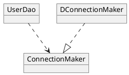

### Week1 210103

95p ~ 143p

## 1.5 스프링의 IoC

### 1.5.1 오브젝트 팩토리를 이용한 스프링 IoC
#### 애플리케이션 컨텍스트와 설정정보

#### DaoFactory를 사용하는 애플리케이션 컨텍스트

### 1.5.2 애플리케이션 컨텍스트의 동작방식
- 클라이언트는 구체적인 팩토리 클래스를 알 필요가 없다
- 애플리케이션 컨텍스트는 종합 IoC 서비스를 제공해준다
- 애플리케이션 컨텍스트는 빈을 검색하는 다양한 방법을 제공한다

### 1.5.3 스프링 IoC의 용어 정리
- 빈
- 빈 팩토리
- 애플리케이션 컨텍스트
- 설정정보/설정 메타정보
- 컨테이너 / IoC 컨테이너
- 스프링 프레임워크

## 1.6 싱글톤 레지스트리와 오브젝트 스코프

### 1.6.1 싱글톤 레지스트리로서의 애플리케이션 컨텍스트
#### 서버 애플리케이션과 싱글톤
#### 싱글톤 패턴의 한계
    - private 생성자를 갖고 있기 때문에 상속할 수 없다
    - 싱글톤은 테스트하기 힘들다
    - 서버환경에서는 싱글톤이 하나만 만들어지는 것을 보장하지 못한다
    - 싱글톤의 사용은 전역 상태를 만들 수 있기 때문에 바람직하지 못하다
#### 싱글톤 레지스트리
- 자바 싱글톤의 한계를 극복하는 스프링 싱글톤 레지스트리 이용
    - 평범한 자바 클래스를 싱글톤으로 활용 가능

### 1.6.2 싱글톤과 오브젝트의 상태
- 싱글톤은 멀티스레드 환경에서 여러 스레드 동시 접근 가능
    - 서비스를 싱글톤 -> 상태를 갖지 않는 무상태성으로 만들어져야 한다
        - 파라미터, 로컬 변수, 리턴 값 등을 이용
    - 자신이 사용하려는 다른 스프링 빈은 인스턴스 변수로 선언하여 사용해도 무방

### 1.6.3 스프링 빈의 스코프
- 싱글톤
- 프로토
    - 빈 요청 시마다 새로운 오브젝트
- request scope
- session scope

## 1.7 의존관계 주입(DI)

### 1.7.1 제어의 역전(IoC)과 의존관계 주입

서블릿 컨테이너처럼 서버에서 동작하는 서비스 컨테이너라는 뜻인지
    -> 서버에서 동작하는 서비스 컨테이너라는 개념은 뭘까?
스프링의 IoC는 `의존관계 주입`이 핵심이 되는 용어라고 인식하면 된다
`의존관계 설정`

### 1.7.2 런타임 의존관계 설정
#### 의존관계
- A ---> B
    - B의 변경이 A에 영향
    - A가 B를 사용
        - A가 B의 메서드 호출
- 의존관계에는 방향성이 있다

#### UserDao의 의존관계

- 현재 UserDao 등의 클래스 간 의존관계는 `설계 모델 관점`에서 이야기
    - 하지만 `런타임 시 만들어지는 의존관계`도 존재
    - 설계 시점 의존관계의 실체화
    
- 설계 시점 의존관계는 클래스가 인터페이스를 통해 느슨한 결합
    - 어떤 구현체를 사용하는 지 알 수 없음
- 런타임 시점 의존관계는 실제로 어떤 구현체를 사용하는 지 나타냄
    - 런타임 시점에 두 오브젝트의 관계를 설정해주는 제 3의 존재
    

#### UserDao의 의존관계 주입
- 의존관계의 주입
    - `주입`은 결국 메소드를 실행하면서 `파라미터로 오브젝트의 레퍼런스를 전달`
        - 생성자
        - setter
        - field <- reflection(?)
    
### 1.7.3 의존관계 검색과 주입
- `의존관계 검색` 개념

### 1.7.4 의존관계 주입의 응용
#### 기능 구현의 교환
#### 부가기능 추가

### 1.7.5 메소드를 이용한 의존관계 주입
- setter를 이용한 주입
- 일반 메소드를 이용한 주입

## 1.8 XML을 이용한 설정
### 1.8.1 XML 설정
#### connectionMaker() 전환
#### userDao() 전환
#### XML의 의존관계 주입 정보

### 1.8.2 XML을 이용하는 애플리케이션 컨텍스트

### 1.8.3 DataSource 인터페이스로 변환
#### DataSource 인터페이스 적용
#### 자바 코드 설정 방식
#### XML 설정 방식

### 1.8.4 프로퍼티 값의 주입
#### 값 주입
#### value 값의 자동 변환

### 1.9 정리

